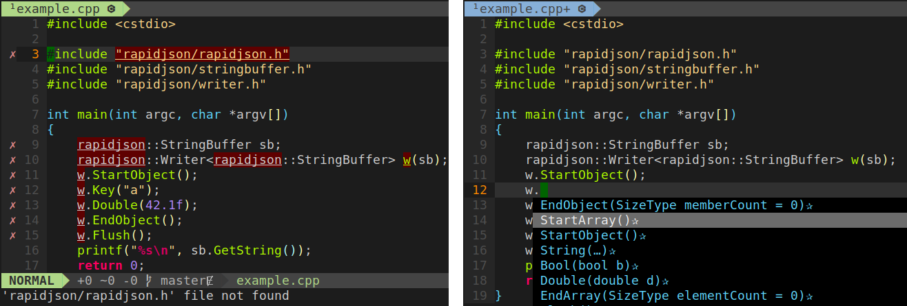

# bazel-compile-commands

Generates [compile_commands.json](https://clang.llvm.org/docs/JSONCompilationDatabase.html) for your bazel project

## What is compile_commands.json
It's a file used by code completion tools, like [clangd](https://clangd.llvm.org/)

Look at [example.cpp](example/example.cpp) in vim with [coc-nvim](https://github.com/neoclide/coc.nvim) plugin with/without that database:

## How to use
See [example](example/)

With `--experimental_action_listener` we generate JSON files for every build piece and with `gen_compile_commands.sh` we make final `compile_commands.json`

## Acknowledgements
- based on [kythe/kythe](https://github.com/kythe/kythe/tree/33b83453a40fa6555cadaa2dab517d2c49510073/kythe/cxx/tools/generate_compile_commands)
- extra_actions_base.proto from [bazelbuild/bazel](https://github.com/bazelbuild/bazel/blob/df37047e4ec45f5d018b436dbb64062cd9148a15/src/main/protobuf/extra_actions_base.proto)
